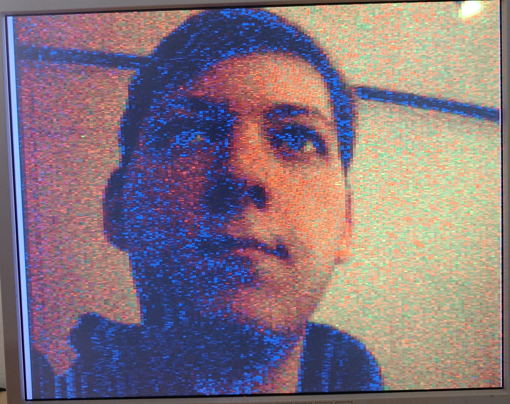
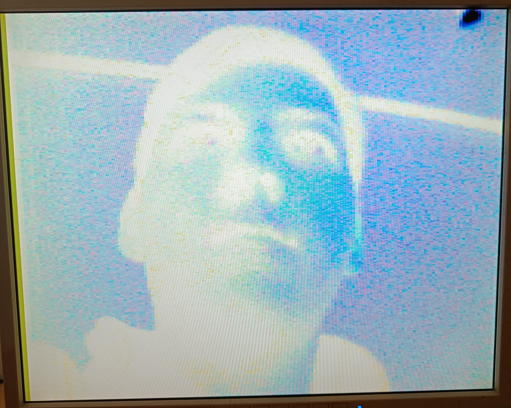
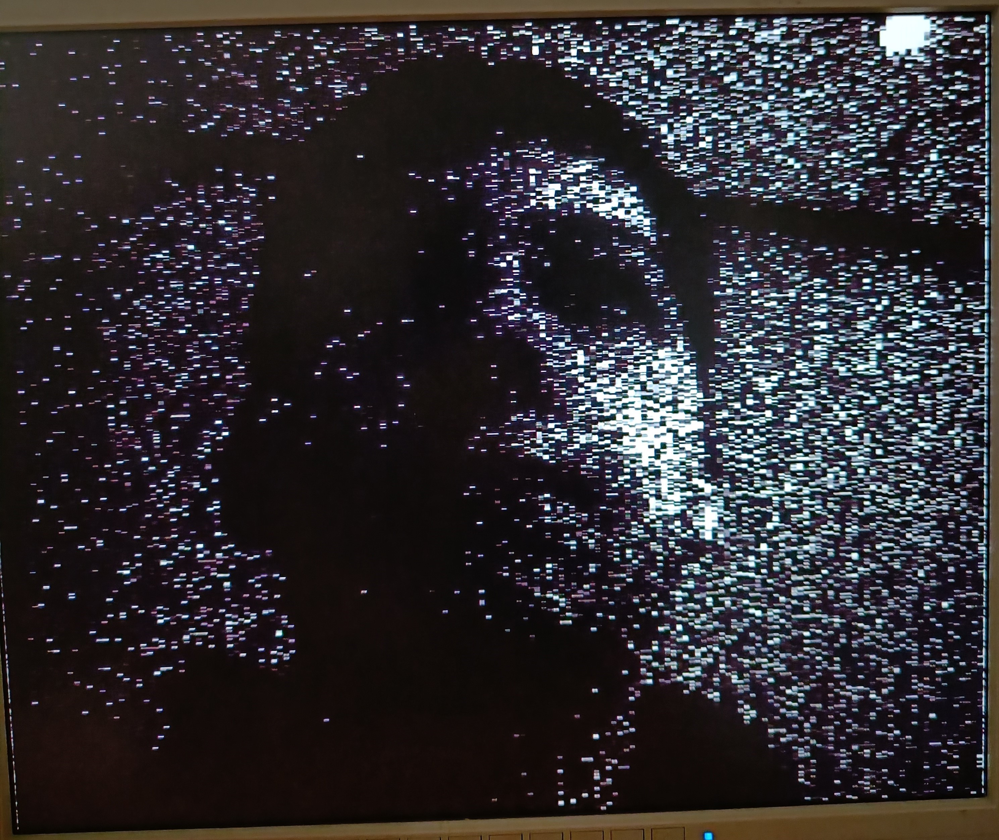
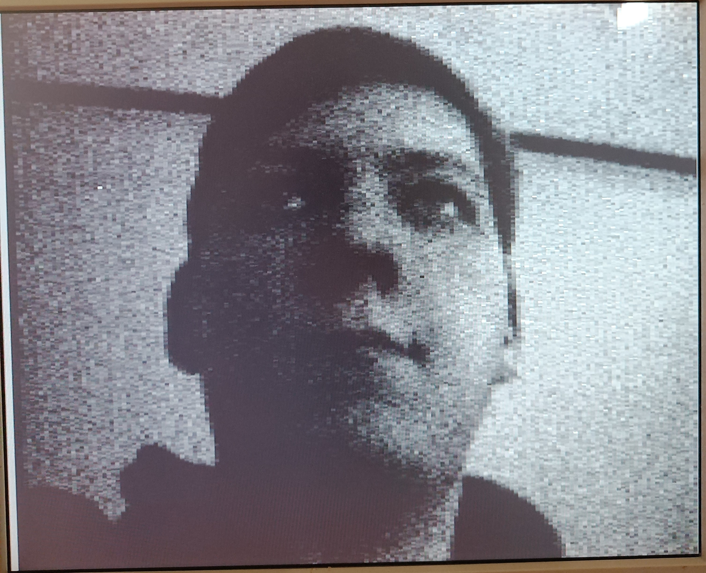

# Project DSD

Hulsbergen Sten  - 3ITIOT

## Inhoud

[1. Doel](##-1-Doel)</br>
[2. Ontwikkelingsplan](##-2-Ontwikkelingsplan)</br>
[3. Testplan](##-3-Testplan)</br>
[4. Camera](##-4-Camera)</br>
[5. VGA](##-5-VGA)</br>
&emsp;[5.1 Code](###-51-Code)</br>
&emsp;[5.2 Resultaat](###-52-Resultaat)</br>
[6. Filters](##-6-Filters)</br>
&emsp;[6.1 Geinverteerd](###-61-Geinverteerd)</br>
&emsp;&emsp;[6.1.1 Code](####-611-Code)</br>
&emsp;&emsp;[6.1.2 Resultaat](####-612-Resultaat)</br>
&emsp;[6.2 Zwart en wit](###-62-Zwart-en-wit)</br>
&emsp;&emsp;[6.2.1 Code](####-621-Code)</br>
&emsp;&emsp;[6.2.2 Resultaat](####-622-Resultaat)</br>
&emsp;[6.3 Kleurloos](###-63-Kleurloos)</br>
&emsp;&emsp;[6.3.1 Code](####-631-Code)</br>
&emsp;&emsp;[6.3.2 Resultaat](####-632-Resultaat)</br>
[7. Compressie](##-7-Compressie)</br>
&emsp;[7.1 Code](###-71-Code)</br>
&emsp;[7.2 Resultaat](###-72-Resultaat)</br>
[8. Datasheets](##-8-Datasheets)</br>
[9. Bronnen](##-9-Bronnen)

## 1. Doel

Het doel van dit project is het opnemen van live videobeelden en deze weergeven op een monitor via VGA. Vervolgens een aantal filters toe te voegen en de effecten ervan te waarnemen op de monitor. En als laatste een video-compressie block toevoegen om minder data te hebben bij het tonen van de beelden.

## 2. Ontwikkelingsplan

1. Bestuderen van de code op FPGA4Student.
2. Verbinden van de camera en het VGA-scherm met de FPGA.
3. Code instellen op FPGA om camera te testen en beelden te tonen via VGA.
4. Uitzoeken wat voor filters er gebruikt gaan worden.
   - Geinverteerd
   - Zwart en wit
   - Kleurloos (grijswaarden)
5. Ontwikkelen van de filters in vhdl en toevoegen aan bestaande code.
6. Video-compressieblok toevoegen aan de code.
7. Testen van het project.
8. Rapport over de resultaten en de leerpunten maken.
9. Presentatie voorbereiden.

## 3. Testplan

1. Test de functionaliteit van de video-opname- en weergavefuncties.
2. Test de effecten van de filters op de video.
3. Test van het video-compressieblok.
4. Valideer de resultaten van het projectrapport.

## 4. Camera

Voor de code van de camera heb ik gebruik gemaakt van de bron *FPGA4Students*, deze heb ik gedownload en verder ingesteld naar de instellingen die nodig zijn bij dit project.

## 5. VGA

Voor de code om de VGA aan te sturen heb ik ook gebruik gemaakt van de bron *FPGA4Students*, maar deze is een groot deel aangepast om te kunnen werken met de nodige filters. De code voor het uitsturen van de kleuren is als volgt:

### 5.1 Code

```
library IEEE;
use IEEE.STD_LOGIC_1164.ALL;
use IEEE.STD_LOGIC_UNSIGNED.ALL;
use ieee.numeric_std.all;


entity RGB is
    Port (
		    filter_switch_inverted : in STD_LOGIC;
            filter_switch_b_and_w : in STD_LOGIC;
            filter_switch_colourless : in STD_LOGIC;
            compression_switch : in std_logic;

            Din : in STD_LOGIC_VECTOR (11 downto 0);
		    Nblank : in	STD_LOGIC;
            R_out, G_out, B_out : out STD_LOGIC_VECTOR (7 downto 0));
end RGB;

architecture Behavioral of RGB is

    signal R_inverted, G_inverted, B_inverted : STD_LOGIC_VECTOR (7 downto 0);
    signal R_b_and_w, G_b_and_w, B_b_and_w : STD_LOGIC_VECTOR (7 downto 0);
    signal R_colourless, G_colourless, B_colourless : STD_LOGIC_VECTOR (7 downto 0);

	COMPONENT filter_inverted
	PORT(
    		switch : in STD_LOGIC;
            Din 	: in	STD_LOGIC_VECTOR (11 downto 0);
		    Nblank : in	STD_LOGIC;
            R_inverted, G_inverted, B_inverted : out	STD_LOGIC_VECTOR (7 downto 0)
		);
	END COMPONENT;

	COMPONENT filter_b_and_w
	PORT(
    		switch : in STD_LOGIC;
            Din 	: in	STD_LOGIC_VECTOR (11 downto 0);
		    Nblank : in	STD_LOGIC;
            R_b_and_w, G_b_and_w, B_b_and_w : out	STD_LOGIC_VECTOR (7 downto 0)
		);
	END COMPONENT;
	
	COMPONENT filter_colourless
	PORT(
    		switch : in STD_LOGIC;
            Din 	: in	STD_LOGIC_VECTOR (11 downto 0);
		    Nblank : in	STD_LOGIC;
            R_colourless, G_colourless, B_colourless : out	STD_LOGIC_VECTOR (7 downto 0)
		);
	END COMPONENT;

begin

	Inst_filter_inverted: filter_inverted PORT MAP(
		switch => filter_switch_inverted,
        Din => Din,
        Nblank => Nblank,
		R_inverted => R_inverted,
		G_inverted => G_inverted,
		B_inverted => B_inverted
	);

	Inst_filter_b_and_w: filter_b_and_w PORT MAP(
		switch => filter_switch_b_and_w,
        Din => Din,
        Nblank => Nblank,
		R_b_and_w => R_b_and_w,
		G_b_and_w => G_b_and_w,
		B_b_and_w => B_b_and_w
	);
	
	Inst_filter_colourless: filter_colourless PORT MAP(
		switch => filter_switch_colourless,
        Din => Din,
        Nblank => Nblank,
		R_colourless => R_colourless,
		G_colourless => G_colourless,
		B_colourless => B_colourless
	);


filters: process(filter_switch_inverted, filter_switch_b_and_w, filter_switch_colourless)
begin
    if Nblank = '1' then
        if filter_switch_inverted = '1' then
            R_out <= R_inverted;
            G_out <= G_inverted;
            B_out <= B_inverted;
        elsif filter_switch_b_and_w = '1' then
            R_out <= R_b_and_w;
            G_out <= G_b_and_w;
            B_out <= B_b_and_w;
        elsif filter_switch_colourless = '1' then
            R_out <= R_colourless;
            G_out <= G_colourless;
            B_out <= B_colourless;
        else
            -- Normale video
--            R_out <=  Din(11 downto 8) & Din(11 downto 8);
--            G_out <= Din(7 downto 4) & Din(7 downto 4);
--            B_out <= Din(3 downto 0) & Din(3 downto 0);

            -- Normale video met aangepaste schalingsfactor voor een meer gebalanceerde kleurweergave
            R_out <= std_logic_vector(resize(to_signed(to_integer(unsigned(Din(11 downto 8))) * 17, 8), 8));
            G_out <= std_logic_vector(resize(to_signed(to_integer(unsigned(Din(7 downto 4))) * 17, 8), 8));
            B_out <= std_logic_vector(resize(to_signed(to_integer(unsigned(Din(3 downto 0))) * 17, 8), 8));
        end if;
    else
        R_out <= "00000000";
        G_out <= "00000000";
        B_out <= "00000000";
    end if;
end process;
end Behavioral;
```

### 5.2 Resultaat

<p align="center">
    
</p>

## 6. Filters

### 6.1 Geinverteerd

De kleuren inverteren is niet moeilijk, hierbij moest alleen `not` geplaatst worden voor de kleuren om te draaien. Hierbij heb ik extra lijnen geplaatst waarbij de kleuren geschaald worden naar 255. Deze waarden worden vervolgens geplaatst op de RGB-lijnen van de VGA.

#### 6.1.1 Code

```
library IEEE;
use IEEE.STD_LOGIC_1164.ALL;
use IEEE.STD_LOGIC_UNSIGNED.ALL;
use ieee.numeric_std.all;


entity filter_inverted is
    Port ( 
    		switch : in STD_LOGIC;
            Din : in STD_LOGIC_VECTOR (11 downto 0);
		    Nblank : in	STD_LOGIC;
            R_inverted, G_inverted, B_inverted : out STD_LOGIC_VECTOR (7 downto 0)
          );
end filter_inverted;

architecture Behavioral of filter_inverted is
begin

filters: process(Din, Nblank)
begin
    if Nblank = '1' then
        if switch = '1' then
            -- Geinverteerde video
--            R_inverted <= not Din(11 downto 8) & Din(11 downto 8);
--            G_inverted <= not Din(7 downto 4)  & Din(7 downto 4);
--            B_inverted <= not Din(3 downto 0)  & Din(3 downto 0);
            
            -- Geinverteerde video met aangepaste schalingsfactor voor een meer gebalanceerde kleurweergave
            R_inverted <= not std_logic_vector(resize(to_signed(to_integer(unsigned(Din(11 downto 8))) * 17, 8), 8));
            G_inverted <= not std_logic_vector(resize(to_signed(to_integer(unsigned(Din(7 downto 4))) * 17, 8), 8));
            B_inverted <= not std_logic_vector(resize(to_signed(to_integer(unsigned(Din(3 downto 0))) * 17, 8), 8));
        end if;
    end if;
end process;
end Behavioral;
```

#### 6.1.2 Resultaat

<p align="center">
    
</p>

### 6.2 Zwart en wit

Dit is wat moeilijker, met een korte berekening kom je uit op alleen wit en zwart waardes, waardoor deze alleen overblijven. Deze waarden worden vervolgens geplaatst op de RGB-lijnen van de VGA.

#### 6.2.1 Code

```
library IEEE;
use IEEE.STD_LOGIC_1164.ALL;
use IEEE.STD_LOGIC_UNSIGNED.ALL;
use ieee.numeric_std.all;


entity filter_b_and_w is
    Port ( 
    		switch : in STD_LOGIC;
            Din : in STD_LOGIC_VECTOR (11 downto 0);
		    Nblank : in	STD_LOGIC;
            R_b_and_w, G_b_and_w, B_b_and_w : out STD_LOGIC_VECTOR (7 downto 0)
          );
end filter_b_and_w;

architecture Behavioral of filter_b_and_w is
begin

filters: process(Din, Nblank)
begin
    if Nblank = '1' then
        if switch = '1' then
            -- Black and white video
            if (Din(11 downto 0) > 2047) then
                R_b_and_w <= "11111111";
                G_b_and_w <= "11111111";
                B_b_and_w <= "11111111";
            else
                R_b_and_w <= std_logic_vector(to_unsigned((to_integer(unsigned(Din(11 downto 8))) + to_integer(unsigned(Din(7 downto 4))) + to_integer(unsigned(Din(3 downto 0)))) / 3, 8));
                G_b_and_w <= std_logic_vector(to_unsigned((to_integer(unsigned(Din(11 downto 8))) + to_integer(unsigned(Din(7 downto 4))) + to_integer(unsigned(Din(3 downto 0)))) / 3, 8));
                B_b_and_w <= std_logic_vector(to_unsigned((to_integer(unsigned(Din(11 downto 8))) + to_integer(unsigned(Din(7 downto 4))) + to_integer(unsigned(Din(3 downto 0)))) / 3, 8));
            end if;
        end if;
    end if;
end process;
end Behavioral;
```

#### 6.2.2 Resultaat

<p align="center">
    
</p>

### 6.3 Kleurloos

Om de kleuren weg te laten en gebruik te maken van grijswaardes was het moeilijkst. Hierbij heb ik grondig gebruik gemaakt van bepaalde bronnen. Deze waarden worden vervolgens geplaatst op de RGB-lijnen van de VGA.

#### 6.3.1 Code

```
library IEEE;
use IEEE.STD_LOGIC_1164.ALL;
use IEEE.STD_LOGIC_UNSIGNED.ALL;
use ieee.numeric_std.all;


entity filter_colourless is
    Port ( 
    		switch : in STD_LOGIC;
            Din : in STD_LOGIC_VECTOR (11 downto 0);
		    Nblank : in	STD_LOGIC;
            R_colourless, G_colourless, B_colourless : out STD_LOGIC_VECTOR (7 downto 0)
          );
end filter_colourless;

architecture Behavioral of filter_colourless is
    type lut_type is array (0 to 4095) of std_logic_vector(7 downto 0);
    signal lut : lut_type := (others => "00000000");
begin
    
filters: process(Din, Nblank)
begin
    if Nblank = '1' then
        if switch = '1' then
            -- Colourless video
            for i in 0 to 4095 loop
                lut(i) <= std_logic_vector(to_unsigned(i, 8));
            end loop;
          
            R_colourless <= lut(to_integer(unsigned(Din)));
            G_colourless <= lut(to_integer(unsigned(Din)));
            B_colourless <= lut(to_integer(unsigned(Din)));
        end if;
    end if;
end process;
end Behavioral;
```

#### 6.3.2 Resultaat

<p align="center">
    
</p>

## 7. Compressie

Dit is het moeilijkste onderdeel van dit project. Veel opzoekwerk komt veel uit op betaalde IP-blocks wat natuurlijk niet goed is. Informatie over het zelf maken van een compressieblock is ook zeer gering, dit onderdeel gaat net wel of net niet klaar zijn.

### 7.1 Code

### 7.2 Resultaat

## 8. Datasheets

[OV7670 Camera](https://www.voti.nl/docs/OV7670.pdf)

## 9. Bronnen

[FPGA4Student: videobeelden via VGA](https://www.fpga4student.com/2018/08/basys-3-fpga-ov7670-camera.html)</br>
[Startingelectronics: inverteerde kleuren filter](https://startingelectronics.com/software/VHDL-CPLD-course/tut1-inverter-buffer/)</br>
[Electronics-stackexchange: zwart en wit filter](https://electronics.stackexchange.com/questions/481870/how-to-implement-vga-controller-for-changing-background-color-in-vhdl)</br>
[Support-xilinx: kleurloos filter](https://support.xilinx.com/s/question/0D52E00006iHtaVSAS/lens-distortion-correction-in-fpga-how-to-get-started-vhdl-vivado?language=zh_CN)</br>
[Esd-cs: kleurloos filter](http://esd.cs.ucr.edu/labs/tutorial/)</br>
